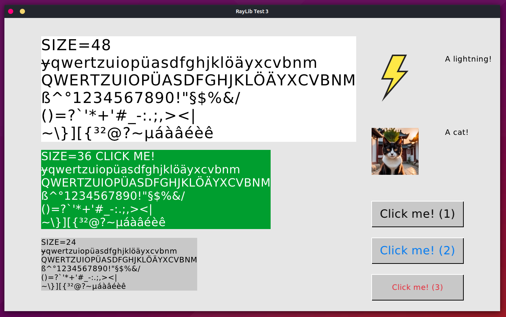

# Raylib GUI Experiments

Some GUI experiments in C with [**Raylib**](https://www.raylib.com/):

- Fonts (ASCII plus codepoints U+00a1 to U+024f),
- Images, 
- Buttons, 
- Labels/Texts, 
- Callbacks